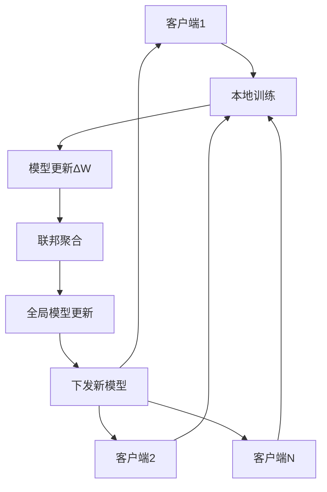

# 联邦学习Token选择器水印系统

## 🎯 项目概述

本项目实现了一个创新的基于联邦学习的Token选择器模型，专门用于在多个大语言模型间协同训练水印嵌入策略。该系统的核心优势是在**不共享用户原始数据或主模型参数**的前提下，学习如何在不同上下文中选择符合水印目标的token，实现了隐私保护与水印嵌入的完美结合。

### 🔬 技术创新点

- **联邦学习架构**：多客户端协同训练，保护数据隐私
- **Token选择策略**：智能选择token以嵌入水印比特序列
- **多目标优化**：平衡水印强度、语义保持和文本流畅性
- **统计检测方法**：基于z-score的可靠水印检测
- **可扩展设计**：支持多种联邦学习算法和水印策略
- **🆕 真实大模型集成**：支持OpenAI API、HuggingFace模型、本地模型接口
- **🆕 多接口支持**：统一的大模型接口，支持不同类型的语言模型

## 🏗️ 系统架构

### 核心组件

#### 1. Token选择器控制器 (`TokenSelectorController`)
- **输入**：当前上下文、大模型logits、目标水印比特
- **输出**：选择的token概率分布（带水印）
- **架构**：基于Transformer的小型神经网络
- **功能**：学习在保持语义的同时嵌入水印信号

#### 2. 联邦学习框架 (`FederatedFramework`)
- **客户端管理**：支持异构客户端环境
- **聚合算法**：FedAvg、FedProx、Scaffold等
- **通信优化**：模型压缩和差分隐私
- **容错机制**：拜占庭容错和异常检测

#### 3. 水印嵌入策略 (`WatermarkStrategy`)
- **绿名单生成**：基于上下文的确定性token选择
- **比特序列管理**：支持自定义水印消息
- **统计特性**：可配置的水印强度参数

#### 4. 水印检测器 (`WatermarkDetector`)
- **统计检测**：基于z-score的假设检验
- **比特提取**：从文本中恢复水印消息
- **性能评估**：准确率、召回率、F1分数等指标

### 🔄 训练流程



## ✨ 核心特性

### 🔒 隐私保护
- ✅ 客户端数据本地化，不上传原始数据
- ✅ 仅共享模型参数更新，保护模型隐私
- ✅ 支持差分隐私机制
- ✅ 安全聚合协议

### 🎯 水印技术
- ✅ 多目标损失函数优化（水印嵌入 + 语义保持 + 流畅性）
- ✅ 可配置的水印强度和检测阈值
- ✅ 支持自定义水印消息和比特序列
- ✅ 鲁棒的统计检测方法

### 🚀 联邦学习
- ✅ 支持多种聚合算法（FedAvg、FedProx、Scaffold）
- ✅ 客户端异构性处理
- ✅ 通信效率优化
- ✅ 系统容错和恢复机制

### 📊 评估与监控
- ✅ 实时训练监控和可视化
- ✅ 全面的性能评估指标
- ✅ 水印检测效果分析
- ✅ 实验结果自动保存和管理

## 🚀 快速开始

### 📋 环境要求

- Python 3.8+
- PyTorch 1.12+
- CUDA 11.0+ (可选，用于GPU加速)

### 📦 安装依赖

```bash
# 克隆项目
git clone https://github.com/qintianyang/fed_token_selector.git
cd federated_token_selector

# 安装依赖
pip install -r requirements.txt
```

### 🎮 运行示例

#### 快速测试（模拟数据）
```bash
cd src
python demo_complete.py --mode quick
```

#### 完整演示（模拟数据）
```bash
cd src
python demo_complete.py --mode full
```

#### 🆕 使用真实大模型
```bash
cd src
python example_with_llm.py
```

#### 联邦学习训练
```bash
cd src
python train_federated.py
```

#### 🆕 大模型集成详细指南

查看详细的大模型集成使用指南：
```bash
cat LLM_INTEGRATION_README.md
```

支持的大模型接口：
- **HuggingFace模型**：本地运行开源模型（推荐用于开发）
- **OpenAI API**：调用GPT系列模型（需要API密钥）
- **本地模型**：自定义模型接口

## 📖 详细使用指南

### 🔧 配置管理

项目使用YAML配置文件管理所有参数：

```python
from config_manager import ConfigManager

# 加载默认配置
config = ConfigManager('config/default_config.yaml')

# 获取特定配置
model_config = config.get_model_config()
training_config = config.get_training_config()
federated_config = config.get_federated_config()
```

## 📁 项目结构

```
federated_token_selector/
├── src/                     # 源代码目录
│   ├── token_selector.py    # Token选择器核心实现
│   ├── federated_framework.py # 联邦学习框架
│   ├── watermark_detector.py   # 水印检测器
│   ├── train_federated.py   # 联邦训练脚本
│   ├── demo_complete.py     # 完整演示脚本
│   └── config_manager.py    # 配置管理器
├── config/                  # 配置文件目录
│   └── default_config.yaml  # 默认配置
├── results/                 # 实验结果目录
├── models/                  # 模型保存目录
├── requirements.txt         # 依赖列表
└── README.md               # 项目说明
```

### 水印检测原理

基于统计假设检验的水印检测：

1. **绿名单重构**：根据上下文重新生成绿名单
2. **统计计算**：计算绿名单token出现频率
3. **假设检验**：使用z-score进行显著性检验

```python
z_score = (observed_greenlist_count - expected_count) / sqrt(variance)
p_value = 1 - norm.cdf(z_score)
```

## 🚀 扩展方向

### 🎓 高级联邦学习技术

- **联邦蒸馏**：主模型作为教师，控制器作为学生
- **联邦对抗训练**：加入反水印对抗者，提升鲁棒性
- **个性化联邦学习**：适配客户端特定需求
- **异步联邦学习**：支持异步更新机制

### 🔐 隐私增强技术

- **差分隐私**：添加噪声保护隐私
- **同态加密**：加密状态下的计算
- **安全多方计算**：无需信任第三方的聚合
- **联邦分析**：隐私保护的统计分析

### 🎯 水印技术改进

- **自适应水印**：根据内容动态调整水印强度
- **多层水印**：在不同层次嵌入水印信息
- **语义水印**：基于语义理解的水印嵌入
- **抗攻击水印**：提升对各种攻击的鲁棒性

### 📊 评估与监控

- **实时监控**：训练过程的实时可视化
- **自动调参**：基于贝叶斯优化的超参数搜索
- **A/B测试**：不同策略的对比实验
- **长期追踪**：模型性能的长期监控


## 🙏 致谢

感谢以下开源项目和研究工作的启发：

- [Flower](https://flower.dev/) - 联邦学习框架
- [A Watermark for Large Language Models](https://arxiv.org/abs/2301.10226) - 水印技术基础
- [FedML](https://fedml.ai/) - 联邦机器学习平台
