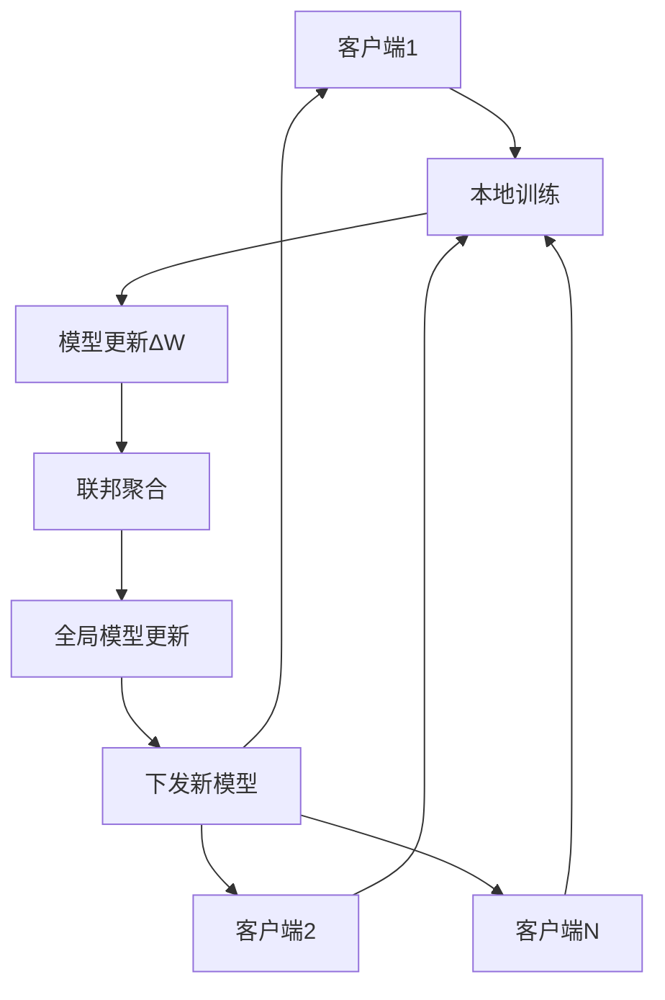

# 联邦学习Token选择器水印系统

## 🎯 项目概述

本项目实现了一个创新的基于联邦学习的Token选择器模型，专门用于在多个大语言模型间协同训练水印嵌入策略。该系统的核心优势是在**不共享用户原始数据或主模型参数**的前提下，学习如何在不同上下文中选择符合水印目标的token，实现了隐私保护与水印嵌入的完美结合。

### 🔬 技术创新点

- **联邦学习架构**：多客户端协同训练，保护数据隐私
- **Token选择策略**：智能选择token以嵌入水印比特序列
- **多目标优化**：平衡水印强度、语义保持和文本流畅性
- **统计检测方法**：基于z-score的可靠水印检测
- **可扩展设计**：支持多种联邦学习算法和水印策略

## 🏗️ 系统架构

### 核心组件

#### 1. Token选择器控制器 (`TokenSelectorController`)
- **输入**：当前上下文、大模型logits、目标水印比特
- **输出**：选择的token概率分布（带水印）
- **架构**：基于Transformer的小型神经网络
- **功能**：学习在保持语义的同时嵌入水印信号

#### 2. 联邦学习框架 (`FederatedFramework`)
- **客户端管理**：支持异构客户端环境
- **聚合算法**：FedAvg、FedProx、Scaffold等
- **通信优化**：模型压缩和差分隐私
- **容错机制**：拜占庭容错和异常检测

#### 3. 水印嵌入策略 (`WatermarkStrategy`)
- **绿名单生成**：基于上下文的确定性token选择
- **比特序列管理**：支持自定义水印消息
- **统计特性**：可配置的水印强度参数

#### 4. 水印检测器 (`WatermarkDetector`)
- **统计检测**：基于z-score的假设检验
- **比特提取**：从文本中恢复水印消息
- **性能评估**：准确率、召回率、F1分数等指标

### 🔄 训练流程



## ✨ 核心特性

### 🔒 隐私保护
- ✅ 客户端数据本地化，不上传原始数据
- ✅ 仅共享模型参数更新，保护模型隐私
- ✅ 支持差分隐私机制
- ✅ 安全聚合协议

### 🎯 水印技术
- ✅ 多目标损失函数优化（水印嵌入 + 语义保持 + 流畅性）
- ✅ 可配置的水印强度和检测阈值
- ✅ 支持自定义水印消息和比特序列
- ✅ 鲁棒的统计检测方法

### 🚀 联邦学习
- ✅ 支持多种聚合算法（FedAvg、FedProx、Scaffold）
- ✅ 客户端异构性处理
- ✅ 通信效率优化
- ✅ 系统容错和恢复机制

### 📊 评估与监控
- ✅ 实时训练监控和可视化
- ✅ 全面的性能评估指标
- ✅ 水印检测效果分析
- ✅ 实验结果自动保存和管理

## 🚀 快速开始

### 📋 环境要求

- Python 3.8+
- PyTorch 1.12+
- CUDA 11.0+ (可选，用于GPU加速)

### 📦 安装依赖

```bash
# 克隆项目
git clone <repository-url>
cd federated_token_selector

# 安装依赖
pip install -r requirements.txt
```

### 🎮 运行示例

#### 快速测试
```bash
cd src
python demo_complete.py --mode quick
```

#### 完整演示
```bash
cd src
python demo_complete.py --mode full


```


#### 联邦学习训练
```bash
cd src
python train_federated.py
```

## 📖 详细使用指南

### 🔧 配置管理

项目使用YAML配置文件管理所有参数：

```python
from config_manager import ConfigManager

# 加载默认配置
config = ConfigManager('config/default_config.yaml')

# 获取特定配置
model_config = config.get_model_config()
training_config = config.get_training_config()
federated_config = config.get_federated_config()
```

### 🎯 核心API使用

#### Token选择器控制器

```python
from token_selector import TokenSelectorController

# 初始化控制器
controller = TokenSelectorController(
    vocab_size=50257,
    context_dim=768,
    hidden_dim=256,
    num_heads=8,
    num_layers=4
)

# 前向传播
context_embeddings = torch.randn(batch_size, seq_len, context_dim)
logits = torch.randn(batch_size, vocab_size)
watermark_bits = torch.randint(0, 2, (batch_size,))

token_probs = controller(context_embeddings, logits, watermark_bits)
```

#### 联邦学习训练

```python
from train_federated import FederatedTrainer

# 初始化训练器
trainer = FederatedTrainer(
    vocab_size=50257,
    context_dim=768,
    num_clients=5,
    aggregation_method='fedavg'
)

# 开始训练
trainer.train(
    num_rounds=100,
    local_epochs=5,
    batch_size=32
)
```

#### 水印检测

```python
from watermark_detector import WatermarkDetector

# 初始化检测器
detector = WatermarkDetector(
    vocab_size=50257,
    gamma=0.25,
    delta=2.0
)

# 检测水印
result = detector.detect_watermark(
    text_tokens=[1, 2, 3, ...],
    context_tokens=[0, 1, 2, ...]
)

print(f"Z-score: {result['z_score']:.3f}")
print(f"P-value: {result['p_value']:.6f}")
print(f"Has watermark: {result['has_watermark']}")
```

### 📊 实验与评估

#### 性能评估

```python
from watermark_detector import WatermarkEvaluator

# 初始化评估器
evaluator = WatermarkEvaluator(detector)

# 评估检测性能
metrics = evaluator.evaluate_detection_performance(
    watermarked_texts=watermarked_samples,
    clean_texts=clean_samples
)

print(f"Accuracy: {metrics['accuracy']:.3f}")
print(f"Precision: {metrics['precision']:.3f}")
print(f"Recall: {metrics['recall']:.3f}")
print(f"F1-Score: {metrics['f1_score']:.3f}")
```

#### 可视化分析

```python
# Z-score分布分析
evaluator.analyze_z_score_distribution(
    watermarked_texts=watermarked_samples,
    clean_texts=clean_samples,
    save_path='results/z_score_distribution.png'
)
```

## ⚙️ 配置说明

### 模型配置

```yaml
model:
  vocab_size: 50257          # 词汇表大小
  context_dim: 768           # 上下文维度
  hidden_dim: 256            # 隐藏层维度
  num_heads: 8               # 注意力头数
  num_layers: 4              # Transformer层数
  dropout: 0.1               # Dropout率
```

### 水印配置

```yaml
watermark:
  gamma: 0.25                # 绿名单比例
  delta: 2.0                 # logits偏置强度
  hash_key: 15485863         # 哈希密钥
  detection_threshold: 4.0   # 检测阈值
```

### 联邦学习配置

```yaml
federated:
  num_clients: 5             # 客户端数量
  aggregation_method: 'fedavg' # 聚合方法
  client_fraction: 1.0       # 参与训练的客户端比例
  local_epochs: 5            # 本地训练轮数
```

### 训练配置

```yaml
training:
  num_rounds: 100            # 联邦学习轮数
  batch_size: 32             # 批大小
  learning_rate: 0.001       # 学习率
  weight_decay: 0.01         # 权重衰减
  loss_weights:
    watermark: 1.0           # 水印损失权重
    semantic: 0.5            # 语义损失权重
    fluency: 0.3             # 流畅性损失权重
```

## 📁 项目结构

```
federated_token_selector/
├── src/                     # 源代码目录
│   ├── token_selector.py    # Token选择器核心实现
│   ├── federated_framework.py # 联邦学习框架
│   ├── watermark_detector.py   # 水印检测器
│   ├── train_federated.py   # 联邦训练脚本
│   ├── demo_complete.py     # 完整演示脚本
│   └── config_manager.py    # 配置管理器
├── config/                  # 配置文件目录
│   └── default_config.yaml  # 默认配置
├── results/                 # 实验结果目录
├── models/                  # 模型保存目录
├── requirements.txt         # 依赖列表
└── README.md               # 项目说明
```

## 🔬 技术细节

### 损失函数设计

系统采用多目标优化策略，平衡三个关键目标：

1. **水印损失** (L_watermark)：确保正确嵌入水印比特
   ```python
   L_watermark = -log(P(token ∈ greenlist | bit=1)) - log(P(token ∉ greenlist | bit=0))
   ```

2. **语义损失** (L_semantic)：保持与原始输出的语义一致性
   ```python
   L_semantic = KL_divergence(P_original, P_watermarked)
   ```

3. **流畅性损失** (L_fluency)：维护文本的自然流畅性
   ```python
   L_fluency = -log(P_language_model(token | context))
   ```

总损失函数：
```python
L_total = λ₁ * L_watermark + λ₂ * L_semantic + λ₃ * L_fluency
```

### 联邦聚合算法

#### FedAvg (联邦平均)
```python
w_{t+1} = Σᵢ (nᵢ/N) * wᵢ
```

#### FedProx (联邦近端)
```python
L_local = L_original + (μ/2) * ||w - w_global||²
```

### 水印检测原理

基于统计假设检验的水印检测：

1. **绿名单重构**：根据上下文重新生成绿名单
2. **统计计算**：计算绿名单token出现频率
3. **假设检验**：使用z-score进行显著性检验

```python
z_score = (observed_greenlist_count - expected_count) / sqrt(variance)
p_value = 1 - norm.cdf(z_score)
```

## 🚀 扩展方向

### 🎓 高级联邦学习技术

- **联邦蒸馏**：主模型作为教师，控制器作为学生
- **联邦对抗训练**：加入反水印对抗者，提升鲁棒性
- **个性化联邦学习**：适配客户端特定需求
- **异步联邦学习**：支持异步更新机制

### 🔐 隐私增强技术

- **差分隐私**：添加噪声保护隐私
- **同态加密**：加密状态下的计算
- **安全多方计算**：无需信任第三方的聚合
- **联邦分析**：隐私保护的统计分析

### 🎯 水印技术改进

- **自适应水印**：根据内容动态调整水印强度
- **多层水印**：在不同层次嵌入水印信息
- **语义水印**：基于语义理解的水印嵌入
- **抗攻击水印**：提升对各种攻击的鲁棒性

### 📊 评估与监控

- **实时监控**：训练过程的实时可视化
- **自动调参**：基于贝叶斯优化的超参数搜索
- **A/B测试**：不同策略的对比实验
- **长期追踪**：模型性能的长期监控

## 🤝 贡献指南

我们欢迎社区贡献！请遵循以下步骤：

1. Fork 项目仓库
2. 创建特性分支 (`git checkout -b feature/AmazingFeature`)
3. 提交更改 (`git commit -m 'Add some AmazingFeature'`)
4. 推送到分支 (`git push origin feature/AmazingFeature`)
5. 开启 Pull Request

### 代码规范

- 遵循 PEP 8 Python 代码规范
- 添加适当的文档字符串和注释
- 编写单元测试覆盖新功能
- 确保所有测试通过

## 📄 许可证

本项目采用 MIT 许可证 - 详见 [LICENSE](LICENSE) 文件

## 📞 联系方式

- 项目维护者：[Your Name]
- 邮箱：[your.email@example.com]
- 项目主页：[https://github.com/your-username/federated_token_selector]

## 🙏 致谢

感谢以下开源项目和研究工作的启发：

- [Flower](https://flower.dev/) - 联邦学习框架
- [A Watermark for Large Language Models](https://arxiv.org/abs/2301.10226) - 水印技术基础
- [FedML](https://fedml.ai/) - 联邦机器学习平台
- [Transformers](https://huggingface.co/transformers/) - 预训练模型库

---

**注意**：本项目仅用于研究和教育目的。在生产环境中使用前，请确保遵循相关的法律法规和伦理准则。

- 联邦蒸馏：主模型作为老师，控制器作为学生
- 联邦对抗训练：加入反水印对抗者
- 客户端差异自适应：适配不同语料风格
- 多任务训练：比特嵌入与语义保持权衡